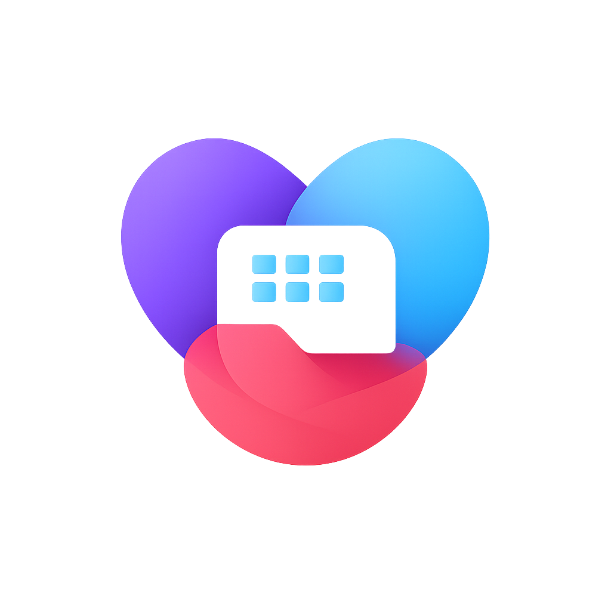

<div align="center">
  

  # El-Sim ✈️

  

  <p>
    <strong>An eSIM and connectivity web project with responsive public pages, account tools, wallet top-ups, product purchases, AI-assisted support, and an admin panel.</strong>
  </p>

  <p>
    
    
    
    
    
  </p>

  <p>
    <a href="#-current-features"></a>
    <a href="#-aspnet-core-app"></a>
    <a href="#-admin-area"></a>
    <a href="#-useful-commands"></a>
  </p>
</div>

---

## ✨ Overview

El-Sim is an eSIM and connectivity web project for Azerbaijan and travel users. The repository contains a static HTML/CSS/JavaScript prototype at the root and the actively developed ASP.NET Core MVC application in `.NET/El-Sim.NET`.

The MVC app now covers the full public storefront flow, authenticated profile and wallet tools, product purchases, generated receipts, support chat with image handling, Gemini-powered support responses, and an admin area for catalog, slider, user, purchase, and AI prompt management.

## 🚀 Current Features

- 📱 Responsive public pages for Home, Plans, Pass, Global Beta, Wi-Fi, Support, Activation, Login, and Profile
- 🎨 Static frontend prototype with shared styling, carousel behavior, mobile navigation, and language switching
- 🧩 ASP.NET Core MVC app with Razor views that mirrors and extends the static pages
- 🔐 Cookie-based authentication with registration, login, logout, blocked-account checks, and optional email two-factor verification
- 👤 User profile management with editable personal data, avatar upload/delete, purchases, receipts, active assets, and wallet balance
- 🖼️ Profile avatar, slider, and support image processing through ImageSharp-based infrastructure services
- 📦 Product catalog for eSIM, local tariffs, Pass packages, Global Beta packages, and optical internet packages
- 🔢 Local and global phone number purchase flows with prefix rules and unique number tracking
- 💳 Wallet balance, Stripe Checkout top-up flow, USD/AZN conversion, wallet transactions, and generated payment receipts
- 🧾 Product purchase tracking with statuses, receipts, exchange-rate snapshots, commission data, and seeded demo purchases
- 💬 Authenticated support chat with persisted sessions, message history, uploaded images, and chat closing/history screens
- 🤖 Gemini-backed support assistant with local context builder, intent detection, seeded AI prompt files, and admin-editable prompt content
- 🛠️ Admin dashboard with users, products, product categories, sliders, purchases, and AI settings
- ⚙️ Admin actions for blocking users, toggling 2FA, editing products, managing category copy, managing sliders, cancelling purchases, and refunding purchases
- 🗄️ SQL Server persistence through Entity Framework Core

## 🧱 Tech Stack

| Layer | Tools |
| --- | --- |
| Static frontend | HTML5, CSS3, vanilla JavaScript |
| Web app | ASP.NET Core MVC, Razor Views, .NET 10 |
| Architecture | Domain, Application, Infrastructure, Persistence, Web projects |
| Data | Entity Framework Core, SQL Server LocalDB / SQL Server |
| Payments | Stripe Checkout |
| AI support | Gemini HTTP client, prompt files, intent detection, support context builder |
| Auth | ASP.NET Core Cookie Authentication, BCrypt password hashing, optional email 2FA |
| Media | ImageSharp-based avatar, slider, and support image processing |
| Rates | CBAR USD/AZN exchange-rate lookup with local fallback |

## 📁 Project Structure

```text
.
|-- Assets/
|   |-- Image/
|   |-- Script/
|   `-- Style/
|-- Admin Panel/
|   `-- Admin Assets/
|-- .NET/
|   `-- El-Sim.NET/
|       |-- El-Sim.Application/
|       |   |-- Catalog/
|       |   `-- Pricing/
|       |-- El-Sim.Domain/
|       |   |-- Entities/
|       |   `-- PhoneNumbers/
|       |-- El-Sim.Infrastructure/
|       |   |-- Email/
|       |   |-- ExchangeRates/
|       |   |-- Images/
|       |   |-- Payments/
|       |   |-- PhoneNumbers/
|       |   `-- Security/
|       |-- El-Sim.Persistence/
|       |   |-- Data/
|       |   |   |-- AI/
|       |   |   `-- ElSimDbContext.cs
|       |   `-- Initialization/
|       |-- El-Sim.Web/
|       |   |-- Controllers/
|       |   |-- Models/
|       |   |-- Services/
|       |   |   `-- AI/
|       |   |-- Views/
|       |   `-- wwwroot/
|       `-- El-Sim.NET.slnx
|-- index.html
|-- plans.html
|-- global.html
|-- pass.html
|-- wifi.html
|-- login.html
`-- README.md
```

## 🖥️ Static Frontend

Open `index.html` directly in a browser to preview the static version.

Main static pages:

- 🏠 `index.html` - landing page, hero slider, activation steps, simple packages, support sections
- 📶 `plans.html` - local tariffs, eSIM prices, speeds, and no-plan pricing
- 🎟️ `pass.html` - monthly Pass membership packages
- 🌍 `global.html` - Global Beta travel data packages
- 🛜 `wifi.html` - optical internet packages and static IP option
- 🔑 `login.html` - login/register prototype with FIN validation

Shared frontend files:

- `Assets/Style/main-style.css`
- `Assets/Style/main-responsive.css`
- `Assets/Script/main-script.js`
- `Assets/Script/lang.js`
- `Assets/Script/carousel.js`

## ⚡ ASP.NET Core App

The main backend/web application is located at:

```bash
cd .NET/El-Sim.NET
dotnet restore
dotnet run --project El-Sim.Web/El-Sim.Web.csproj
```

Then open the local URL printed by `dotnet run`.

Important routes:

- `/`, `/index.html` - home
- `/plans.html` - local plans and number purchase entry points
- `/pass.html` - Pass packages
- `/global.html` - Global Beta packages and global number purchase entry points
- `/wifi.html` - optical internet packages
- `/support.html` - authenticated support chat
- `/activation.html` - authenticated activation/help page
- `/login.html` - login/register
- `/profile.html` - authenticated user profile and wallet
- `/profile/purchases` - purchase history
- `/profile/receipts` - payment receipts
- `/support/history` - support chat history
- `/wallet/topup/success` - Stripe top-up callback
- `/admin` - admin dashboard
- `/admin/users` - user management
- `/admin/products` - product management
- `/admin/productcategory/{category}` - category editor
- `/admin/sliders` - slider management
- `/admin/purchases` - purchase management
- `/admin/ai` - AI prompt/settings editor

## 🔧 Configuration

The MVC app expects local configuration for:

- `ConnectionStrings:DefaultConnection`
- `Email` or legacy `EmailSettings`
- `Stripe:PublishableKey`
- `Stripe:SecretKey`
- `Stripe:Currency`
- `Gemini:ApiKey`
- `Gemini:Model`

Keep real secrets in local `appsettings.json`, user secrets, or environment variables. Do not commit production credentials.

Example shape:

```json
{
  "ConnectionStrings": {
    "DefaultConnection": "Server=(localdb)\\MSSQLLocalDB;Database=ElSimDb;Trusted_Connection=True;TrustServerCertificate=True;"
  },
  "Email": {
    "From": "example@example.com",
    "Password": "local-password-or-app-token",
    "Host": "smtp.example.com",
    "Port": 587
  },
  "Stripe": {
    "PublishableKey": "pk_test_...",
    "SecretKey": "sk_test_...",
    "Currency": "usd"
  },
  "Gemini": {
    "ApiKey": "local-gemini-key",
    "Model": "gemini-3.1-flash-lite"
  }
}
```

## 🗃️ Data Model Highlights

Persistence entities currently include:

- `Account`
- `AppUser`
- `UserAssets`
- `Product`
- `ProductPurchase`
- `PaymentReceipt`
- `WalletTransaction`
- `HomeSlider`
- `TwoFactorCode`
- `AppSetting`
- `SupportChat`
- `SupportChatMessage`
- `SupportChatImage`

Startup services seed or initialize account, product, purchase, and support/AI data when the web app starts.

## 🛡️ Admin Area

The admin area is implemented in `AdminController` with Razor views under `El-Sim.Web/Views/Admin`.

Current admin screens:

- 📊 Dashboard
- 👥 Users
- 📦 Products
- 🧮 Product category editor
- 🖼️ Sliders
- 🧾 Purchases
- 🤖 AI settings

Current admin capabilities:

- 🔎 Search users and purchases
- 🚫 Block/unblock users
- 🔐 Enable/disable two-factor verification
- ✏️ Add, update, and delete products across eSIM, Pass, Tariffs, Global, and Wi-Fi categories
- 🧮 Edit localized category headings, descriptions, product copy, prices, features, flags, and sort order
- 🖼️ Add, update, delete, order, filter, and localize desktop/mobile slider images
- ↩️ Cancel or refund purchases with wallet and receipt updates
- 🤖 Configure AI prompt files used by support chat

## 💬 Support & AI

Support lives in `SupportController`, `support-chat.js`, and the `El-Sim.Web/Services/AI` folder.

- 🧠 `ContextBuilder` prepares user, product, wallet, purchase, and uploaded-image context
- 🎯 `IntentDetector` routes support intent before the model response
- 💬 `GeminiService` talks to the configured Gemini model
- 🖼️ `SupportImageProcessor` stores optimized support uploads under runtime uploads
- 🧹 `SupportChatCleanupService` removes expired support data at startup
- 📚 Seed prompt files live in `.NET/El-Sim.NET/El-Sim.Persistence/Data/AI/`

## 🧭 Notes For Development

- Root HTML files are the static prototype.
- `.NET/El-Sim.NET/El-Sim.Web` is the actively developed MVC app.
- Runtime uploads live under `wwwroot/Uploads/` and are ignored by Git.
- AI prompt seed files live under `.NET/El-Sim.NET/El-Sim.Persistence/Data/AI/`; local/private prompt overrides should stay out of commits when needed.
- Build artifacts, `bin/`, `obj/`, `artifacts/`, logs, local databases, local config files, and runtime uploads are ignored.
- The project currently uses `net10.0`; install a compatible .NET SDK before building.

## 🧪 Useful Commands

```bash
# Restore packages
dotnet restore .NET/El-Sim.NET/El-Sim.NET.slnx

# Build the MVC app
dotnet build .NET/El-Sim.NET/El-Sim.Web/El-Sim.Web.csproj

# Run the MVC app
dotnet run --project .NET/El-Sim.NET/El-Sim.Web/El-Sim.Web.csproj
```

## 🗺️ Roadmap Ideas

- ✅ Add automated tests for auth, profile, wallet, purchase, and support flows
- 🧬 Add database migrations and documented setup scripts
- 🛡️ Add stronger admin authorization boundaries and role checks across the whole admin panel
- 🔒 Add production-safe secret management documentation
- 🌐 Improve translation coverage across MVC views and static prototype files
- 💳 Connect real checkout/purchase fulfillment for all package types
- 🤖 Add safer AI moderation, prompt audit history, and support escalation tools

<div align="center">
  <strong>Built for connected journeys. 🌐</strong>
</div>
